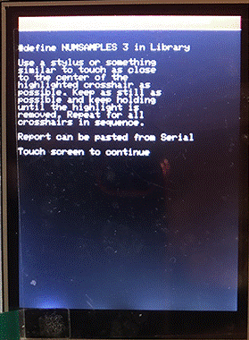
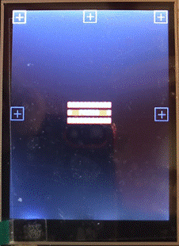
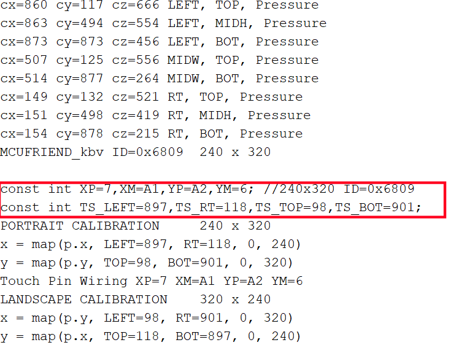

# EX-FastClock

## Calibration

The MCUFRIEND style shield used in this project is usually a cheap(ish) import from China.  These come with a variety of processor chips and various tolerances on the touch screen.  As such before use it is necessary to carry out a calibration routine.  The MCUFRIEND library contains a routine for this and a number ot test programs to test out the functionality of the TFT/Touch screen.

To carry out the calibration please carry out the following steps:

1. In either VSCODE/PlatformIO or Arduino IDE locate and load the sketch TouchScreen_Calibr_Native.ino  This should be found in the MCUFRIEND_kbv/examples folder in the libraries.  By default this test is setup to run using the screen in Portrait mode which is the correct orientation.

2. Load a System Monitor - this will display any output from the test program.

3. Compile and upload this sketch to the Arduino UNO - this should generate the screen shown below.

4.  Touching the screen will then display the calibration screen shown in Fig 2 below:

 As requested - using a stylus press the crosses displayed in the squares in turn.  When this process is complete the configuration data will be displayed on the screen.  The same data should be displayed on the System Monitor.  The output should look like that shown in Fig 3 below:

 

5. Cut/Copy the two lines indicated in Fig 3. and paste them into the appropriate space in the config.h file from the EX-Fast_Clock code.

